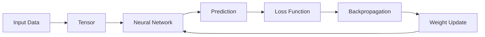
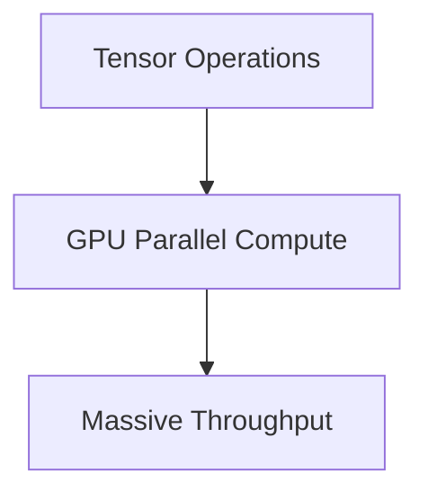
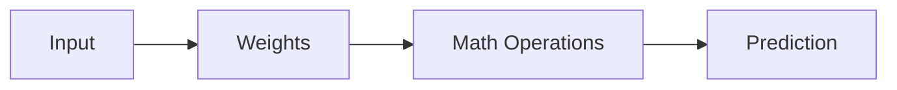
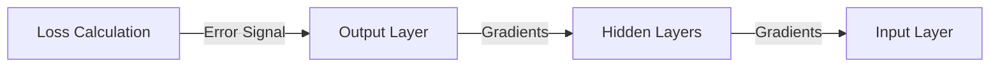
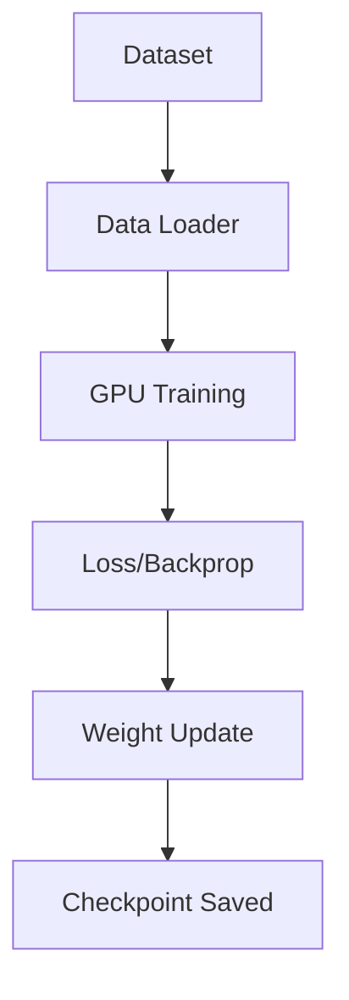

# AI Foundations for Software Engineers

**Date**: 2026-05-09

---

## Table of Contents
1. [Target: The AI "Instruction Cycle"](#1-target-the-ai-instruction-cycle)
2. [Workflow Architecture: The Training Loop](#2-workflow-architecture-the-training-loop)
3. [Core Concept: Tensors](#3-core-concept-tensors)
    - [3.1 What is a Tensor?](#31-what-is-a-tensor)
    - [3.2 The GPU Mindset](#32-the-gpu-mindset)
4. [Neural Networks as Function Approximators](#4-neural-networks-as-function-approximators)
5. [Deep Dive: Weights (The Network's Memory)](#5-deep-dive-weights-the-networks-memory)
    - [5.1 Weight as Signal Strength](#51-weight-as-signal-strength)
    - [5.2 Distributed Intelligence](#52-distributed-intelligence)
    - [5.3 Hierarchical Feature Learning](#53-hierarchical-feature-learning)
6. [The Forward Pass (Inference)](#6-the-forward-pass-inference)
7. [The Loss Function (Error Measurement)](#7-the-loss-function-error-measurement)
    - [7.1 Core Intuition](#71-core-intuition)
    - [7.2 Common Loss Functions](#72-common-loss-functions)
8. [Backpropagation (The Credit Assignment System)](#8-backpropagation-the-credit-assignment-system)
    - [8.1 The "Back" in Backpropagation](#81-the-back-in-backpropagation)
    - [8.2 The Chain Rule and Gradients](#82-the-chain-rule-and-gradients)
9. [Gradient Descent (The Optimization Engine)](#9-gradient-descent-the-optimization-engine)
    - [9.1 The Mountain Analogy](#91-the-mountain-analogy)
    - [9.2 Learning Rate (Step Size)](#92-learning-rate-step-size)
    - [9.3 Convergence vs. Divergence](#93-convergence-vs-divergence)
10. [Epoch and Batch (Dataset Management)](#10-epoch-and-batch-dataset-management)
    - [10.1 Epoch: One Full Pass](#101-epoch-one-full-pass)
    - [10.2 Batch: Small Chunks for GPU Memory](#102-batch-small-chunks-for-gpu-memory)
11. [Training vs. Inference (Systems Engineering)](#11-training-vs-inference-systems-engineering)
    - [11.1 What is Training?](#111-what-is-training)
    - [11.2 What is Inference?](#112-what-is-inference)
12. [CPU vs. GPU (Architectural Mindset)](#12-cpu-vs-gpu-architectural-mindset)
    - [12.1 CPU Architecture](#121-cpu-architecture)
    - [12.2 GPU Architecture](#122-gpu-architecture)
13. [AI Does NOT "Understand"](#13-ai-does-not-understand)
    - [13.1 Statistical Correlations](#131-statistical-correlations)
    - [13.2 LLM Next-Token Prediction](#132-llm-next-token-prediction)
14. [Architecture Analysis Exercises](#14-architecture-analysis-exercises)
    - [14.1 Analyze ChatGPT](#141-analyze-chatgpt)
    - [14.2 Analyze Image Recognition](#142-analyze-image-recognition)
    - [14.3 Analyze a RAG System](#143-analyze-a-rag-system)

---

## 1. Target: The AI "Instruction Cycle"

In traditional computing, we have the CPU instruction cycle. In AI, the fundamental cycle of progress is:

**Data** → **Tensor** → **Neural Network** → **Forward Pass** → **Loss** → **Backpropagation** → **Weight Update** → **Improved Model**

---

## 2. Workflow Architecture: The Training Loop

The training loop is the engine that drives AI learning.

---

## 3. Core Concept: Tensors

### 3.1 What is a Tensor?
Tensors are multi-dimensional containers for data. For a Software Engineer (SWE), you can map them to familiar data structures:

| SWE Concept | AI (Tensor) Concept |
| :--- | :--- |
| Variable | Scalar (0D Tensor) |
| Array | Vector (1D Tensor) |
| Matrix | 2D Tensor |
| Image Buffer | 3D Tensor (Height x Width x Channels) |
| Video Stream | 4D Tensor (Frames x Height x Width x Channels) |

### 3.2 The GPU Mindset
The core of AI is **Massive Parallel Matrix Computation**. GPUs handle extremely large matrix operations by dividing the work among thousands of tiny cores.

---

## 4. Neural Networks as Function Approximators

A Neural Network is essentially a machine that learns to approximate complex mathematical functions:
- **Traditional Math:** $f(x) = 2x + 1$
- **Neural Network:** $g(x) \approx f(x)$

---

## 5. Deep Dive: Weights (The Network's Memory)

Weights are numerical parameters that control how strongly information flows through the network.

### 5.1 Weight as Signal Strength
In the calculation $y = wx + b$, the weight ($w$) decides the input's importance:
- `10.0`: Strong influence
- `0.001`: Almost ignored
- `-5.0`: Strong negative influence

### 5.2 Distributed Intelligence
Knowledge is **distributed** across the entire network, not stored in a single weight. This is known as **Distributed Representation**.

### 5.3 Hierarchical Feature Learning
| Layer Depth | Learned Features |
| :--- | :--- |
| **Early Layers** | Edges, textures, brightness |
| **Middle Layers** | Shapes, parts (ears, eyes) |
| **Deep Layers** | Objects, abstract concepts (cat face) |

---

## 6. The Forward Pass (Inference)

The forward pass is the process where input flows forward through the network (Input → Hidden → Output) to produce an output.

| Phase | Purpose |
| :--- | :--- |
| **Training** | Learn and update weights via backpropagation |
| **Inference** | Use learned weights to predict new data |

---

## 7. The Loss Function (Error Measurement)

The loss function answers the question: **"How wrong was the model?"**

### 7.1 Core Intuition
Imagine teaching a child math. If they say $5 + 5 = 13$, you tell them they are "far from correct." That "distance" from the correct answer is the **Loss**.

- **Goal of Training:** Minimize the Loss ($ \min L(y, \hat{y}) $).
- **Feedback:** Without loss, the model has no compass to know if it is improving.

### 7.2 Common Loss Functions
| Type | Usage | Logic |
| :--- | :--- | :--- |
| **Mean Squared Error (MSE)** | Regression (Predicting numbers) | Punishes larger mistakes heavily. |
| **Cross Entropy Loss** | Classification (CNNs, LLMs) | Measures confidence in the correct class. |

---

## 8. Backpropagation (The Credit Assignment System)

Backpropagation is the mechanism that allows a network to detect mistakes and calculate which weights were responsible.

### 8.1 The "Back" in Backpropagation
The error signal flows backward: **Output Layer → Hidden Layers → Input Layer**.

### 8.2 The Chain Rule and Gradients
Backpropagation uses the **Chain Rule** (Calculus) to compute the **Gradient** ($\frac{\partial L}{\partial w}$). The gradient tells the optimizer:
1. The **direction** to move the weight.
2. The **strength** of the update needed.

---

## 9. Gradient Descent (The Optimization Engine)

Gradient Descent is the algorithm that uses the gradients from backpropagation to update the weights.

### 9.1 The Mountain Analogy
Imagine you are on a mountain at night. You can't see the valley, but you can feel the slope under your feet. Gradient Descent tells you to take a step in the direction where the slope goes down most steeply.

### 9.2 Learning Rate (Step Size)
The Learning Rate ($\eta$) decides how big each step is:
- **Too Small:** Takes forever to converge.
- **Too Large:** "Overshoots" the valley and might never stabilize (Divergence).

**Update Rule:** $w = w - \eta \nabla L$

### 9.3 Convergence vs. Divergence
- **Convergence:** Weights stabilize at a minimum loss.
- **Divergence:** Loss explodes (becomes `NaN` or infinity) because the steps are too aggressive.

---

## 10. Epoch and Batch (Dataset Management)

Modern datasets are too large to fit into GPU memory at once. We manage this using Batches and Epochs.

### 10.1 Epoch: One Full Pass
An **Epoch** is one complete pass through the entire dataset. A model usually requires many epochs (e.g., 10, 50, 100) to learn complex patterns.

### 10.2 Batch: Small Chunks for GPU Memory
A **Batch** is a small subset of the data processed at once.
- **Batch Size:** The number of samples processed before updating weights (e.g., 32, 64, 128).
- **Why?** GPUs have limited VRAM (e.g., 24GB). You cannot load a 2TB dataset into memory, so you load it in small batches.

> **Related Reading:** To understand the difference between **Batch** (Compute) and **Chunk** (Data Retrieval), see: [Compare Chunk vs. Batch](Compare-Chunk-Batch.md)

**The Iterative Cycle:**
1. Load **Batch**.
2. **Forward Pass** → **Loss** → **Backpropagation**.
3. **Update Weights**.
4. Repeat for all batches until the **Epoch** is complete.

---

## 11. Training vs. Inference (Systems Engineering)

Training and Inference are often separate architectures with different hardware and optimization goals.

### 11.1 What is Training?
Training is the process where a model learns patterns from a labeled dataset. It requires both a **Forward Pass** (to predict) and a **Backward Pass** (to update weights).

- **Backward Pass:** This is computationally expensive and requires storing intermediate "activations" in GPU memory.

### 11.2 What is Inference?
Inference is using a trained, "frozen" model to generate predictions. No weight updates occur, and it is much lighter than training.

| Feature | Training | Inference |
| :--- | :--- | :--- |
| **Goal** | Learn patterns | Generate predictions |
| **Weights** | Changing (Mutable) | Frozen (Immutable) |
| **Hardware** | Heavy GPU Clusters | Edge, CPU, or Single GPU |
| **Key Metric** | Convergence/Time | Latency/Throughput |

---

## 12. CPU vs. GPU (Architectural Mindset)

### 12.1 CPU Architecture
A CPU is an expert architect. It is optimized for **complex logic, branching, and sequential execution**. It has a few powerful cores designed to handle difficult, single-threaded tasks.

### 12.2 GPU Architecture
A GPU is a massive team of 10,000 workers. It is optimized for **Massive Parallel Arithmetic**. It excels at performing the same simple operation (like multiplication) on millions of different data points simultaneously.

**Why GPUs dominate AI:** Deep Learning is essentially large-scale matrix multiplication—a task that fits perfectly with the GPU's parallel nature.

---

## 13. AI Does NOT "Understand"

### 13.1 Statistical Correlations
AI optimizes for **Statistical Correlations**, not logical understanding. It learns pattern probability mappings (e.g., "whiskers + tail = cat").

### 13.2 LLM Next-Token Prediction
Large Language Models primarily predict **Next-Token Probabilities**. They generate text by selecting the most likely next word based on the context of previous words.

**Engineering Insight:** Never architect systems assuming AI has human "logic." Always implement validation, guardrails, and fallback systems.

---

## 14. Architecture Analysis Exercises

### 14.1 Analyze ChatGPT (Distributed Inference)
- **Input:** User prompt → Tokenizer → Vector Embedding.
- **Process:** Transformer layers compute attention between tokens.
- **Output:** Next-token probability distribution → Streaming response.

### 14.2 Analyze Image Recognition (Hierarchical Pipeline)
- **Input:** Image resize → Tensor conversion (e.g., 224x224x3).
- **Process:** CNN/ViT extracts hierarchical features (Edges → Shapes → Objects).
- **Output:** Classification label (e.g., "Cat").

### 14.3 Analyze a RAG System (Retrieval + Generation)
- **Step 1:** Chunk documents and store as vectors in a Vector DB.
- **Step 2:** Retrieve semantically similar chunks based on user query.
- **Step 3:** Inject retrieved chunks into the LLM prompt context for an grounded answer.

---

**Final Mental Model:** AI does not "think" via logic rules; it iteratively reshapes its mathematical parameters to minimize error signals through a massive optimization process.
