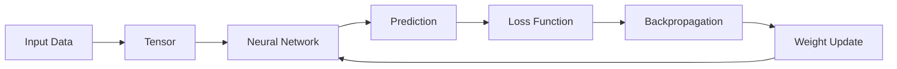
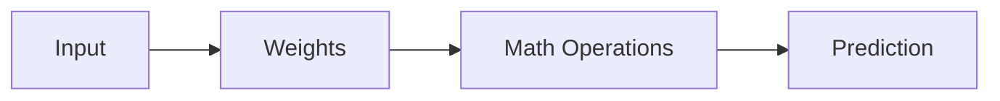
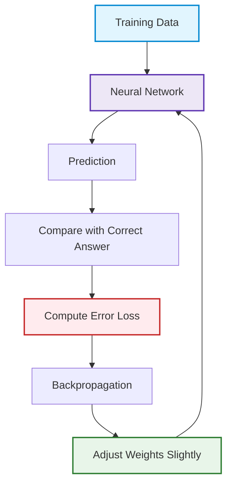
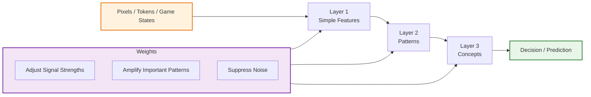
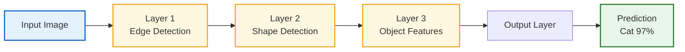

**Day**: 09/05/2026

# Tagret "CPU instruction cycle":

Data
→ Tensor
→ Neural Network
→ Forward Pass
→ Loss
→ Backpropagation
→ Weight Update
→ Improved Model

# Workflow architecture (Training Loop):



## Tensor Thinking (BASE CORE CONCEPT):

**1. What is Tensor?**
This is a multi-dimentional container data

- Mapping thinking:
  **SWE world** **AI world**
  - variable <-> scalar tensor
  - array <-> vector tensor
  - matrix <-> 2D tensor
  - image buffer <-> 3D tensor
  - video stream <-> 4D tensor

- Real-life example:
  **Image RGB**
  ```
  Height x Width x Channel
  ```
  Channel: color data layer each pixel. The image has 3 channels that is R (Red), G (Green), B (Blue)
  Example: Image Shape = Height × Width × Channel
  = 1080 × 1920 × 3

**Why Tensor is important?**
Core of AI is a:
**"MASSIVE PARALLEL MATRIX COMPUTATION"**: handle extremely large matrix operations by dividing the work among processors running simultaneously.
GPU used for this.

Architecture GPU mindset:
flowchart TD
A[Tensor Operations]
--> B[GPU Parallel Compute]
--> C[Massive Throughput]

**2. What is Neural Network?**
Neural Network is essentially a machine that learns to approximate aan extremely complex mathematical function.
**Neural network = function approximation system**
In math: function is f(x) = y ; Input-> Output

```
f(x)=2x+1
```

Neural Network do it similarly:
Input -> Output
example img classifier:
img -> "cat"
RL:
game state-> best action
**BUT** do not exactly correct formular.

```
Example: f(img) = cat ?
Input: Image of cat
Output: 0.98 = cat

```

NN study for estimate
**g(x)≈f(x)**

**Mental model**



**What is Weight?**

## Core Idea

A neural network weight is:

```text
a numerical parameter that controls how strongly information flows through the network
```

Weights are not:

- explicit knowledge
- symbolic logic
- facts stored directly

Instead, they are:

```text
compressed statistical patterns learned from data
```

---

# 1. Simplest Mental Model

Imagine a neuron:

```text
input -> multiply by weight -> output
```

Mathematically:

genui{"math_block_widget_always_prefetch_v2":{"content":"y=wx+b"}}

Where:

- `x` = input
- `w` = weight
- `b` = bias
- `y` = output

The weight decides:

```text
How important is this input?
```

---

# 2. Weight as Signal Strength

Example:

| Weight  | Meaning                   |
| ------- | ------------------------- |
| `10.0`  | very strong influence     |
| `0.001` | almost ignored            |
| `-5.0`  | strong negative influence |

So weights shape:

- attention
- importance
- influence
- feature activation

---

# 3. Neural Network Learning

At the beginning:

```text
weights = random small numbers
```

Example:

```text
0.02
-0.13
0.004
```

The network initially knows nothing.

---

During training:

```text
predict -> compute error -> adjust weights
```

Update rule:

w=w-\eta\nabla L

Where:

- `η` = learning rate
- `∇L` = gradient of error

The network slowly changes weights to reduce mistakes.

---

# 4. Important Insight

A single weight is NOT intelligent.

Intelligence emerges from:

```text
billions of weights interacting together
```

---

# 5. Distributed Intelligence

Knowledge is NOT stored like:

```text
weight #1827 = cat knowledge
```

Instead:

```text
knowledge is distributed across the entire network
```

This is called:

```text
distributed representation
```

---

# 6. Hierarchical Feature Learning

In CNNs:

| Layer         | Learns            |
| ------------- | ----------------- |
| Early layers  | edges, textures   |
| Middle layers | shapes, parts     |
| Deep layers   | objects, concepts |

Weights gradually organize themselves into pattern detectors.

---

# 7. Weight = Learned Memory

Not RAM memory.

Instead:

```text
weights = numerical representation of learned patterns
```

After training:

- the dataset disappears
- only weights remain

Those weights encode:

- correlations
- structures
- probabilities
- latent patterns

---

# 8. Why Numbers Can Create Intelligence

Because intelligence emerges from:

- massive scale
- nonlinear interactions
- optimization
- hierarchical representations

Just like:

- neurons in a brain
- transistors in a computer
- ants in a colony

Simple units → complex emergent behavior.

---

# 9. Architecture-Level Understanding

Traditional programming:

```text
rules -> outputs
```

Machine learning:

```text
examples -> learned weights -> outputs
```

The "logic" is no longer handwritten.

It is mathematically sculpted into the weights.

---

# 10. The Most Important Mental Model

Do NOT think:

```text
weights = facts
```

Think:

```text
weights collectively shape how information flows through the network
```

And:

```text
intelligence emerges from those information-flow dynamics
```

---

# Mermaid Visualization — Weight Learning Flow



---

# Mermaid Visualization — How Weights Build Intelligence



---

# Final Insight

Neural networks are not magical thinking machines.

They are:

```text
massive mathematical systems that learn to organize information flow through weight optimization
```

And what we call:

```text
"intelligence"
```

is often:

```text
highly effective pattern approximation and representation learning
```

# STEP 4 — Forward Pass (Inference)

## Core Idea

A forward pass is the process where:

> input flows through the neural network to produce an output

This is the phase where the model uses its learned weights to make predictions.

---

# Why Is It Called "Forward"?

Because data moves in one direction:

```text
Input Layer
    ↓
Hidden Layers
    ↓
Output Layer
```

The signal propagates forward through the network.

No weight updates happen during this stage.

---

# Forward Pass vs Training

| Phase                    | Purpose                            |
| ------------------------ | ---------------------------------- |
| Training                 | Learn and update weights           |
| Inference / Forward Pass | Use learned weights for prediction |

---

# Example — Image Classification

Input:

```text
Image of a cat
```

The image passes through multiple layers.

---

## Layer 1 — Edge Detection

The first layers detect:

- edges
- corners
- brightness changes
- simple textures

Example:

- horizontal lines
- vertical lines
- curves

---

## Layer 2 — Shape Detection

The network combines edges into larger structures:

```text
edges → shapes
```

Example:

- ears
- eyes
- paws

---

## Layer 3 — Object Features

Higher layers learn semantic features:

```text
shapes → object concepts
```

Example:

- cat face
- dog body
- car wheel

---

## Output Layer

The final layer produces probabilities.

Example:

| Class | Probability |
| ----- | ----------- |
| Cat   | 0.97        |
| Dog   | 0.02        |
| Car   | 0.01        |

The model predicts:

```text
Cat
```

---

# Mathematical Operation Inside Each Layer

Each layer performs a transformation:

\[
y = Wx + b
\]

Where:

- `x` = input
- `W` = weights
- `b` = bias
- `y` = transformed output

Then an activation function is applied.

Example: ReLU

\[
f(x) = \max(0, x)
\]

This allows the network to learn nonlinear patterns.

---

# Role of Weights During Forward Pass

Weights determine:

- which features are important
- which signals are amplified
- which patterns activate neurons

Example:

```text
cat-ear features strongly activate cat-related neurons
```

---

# Information Flow Perspective

A forward pass is not "human thinking."

It is:

```text
hierarchical information transformation
```

The network gradually transforms raw input into abstract representations.

Example flow:

```text
pixels
→ edges
→ shapes
→ object features
→ prediction
```

---

# Mermaid Diagram — Forward Pass Flow



---

# CNN Perspective

In Convolutional Neural Networks (CNNs):

| Layer Type    | Learns            |
| ------------- | ----------------- |
| Early Layers  | edges, textures   |
| Middle Layers | shapes, parts     |
| Deep Layers   | semantic concepts |

The deeper the layer:

- the more abstract the representation becomes.

---

# LLM Perspective

Input:

```text
"Today is a beautiful"
```

Forward pass:

```text
tokens
→ embeddings
→ attention layers
→ transformer blocks
→ probability distribution
```

Output:

```text
"day"
```

---

# Reinforcement Learning Perspective

Input:

```text
game state
```

Forward pass:

```text
state
→ policy network
→ action probabilities
```

Output:

```text
move left
```

---

# Key Insight

Forward pass is fundamentally:

```text
running learned mathematical transformations through optimized weights
```

The model is not explicitly reasoning like humans.

Instead, it is:

```text
propagating signals through learned hierarchical representations
```

---

# Final Mental Model

Do NOT think:

```text
AI thinks like a human
```

Think:

```text
AI transforms information through layers using learned weight structures
```

That is the foundation of:

- CNNs
- Transformers
- Reinforcement Learning networks
- AlphaZero
- Large Language Models
