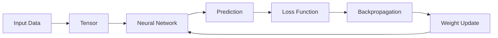
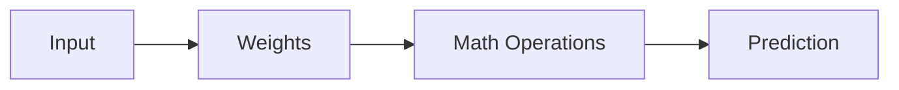

**Day**: 09/05/2026

# Tagret "CPU instruction cycle":

Data
→ Tensor
→ Neural Network
→ Forward Pass
→ Loss
→ Backpropagation
→ Weight Update
→ Improved Model

# Workflow architecture (Training Loop):



## Tensor Thinking (BASE CORE CONCEPT):

**1. What is Tensor?**
This is a multi-dimentional container data

- Mapping thinking:
  **SWE world** **AI world**
  - variable <-> scalar tensor
  - array <-> vector tensor
  - matrix <-> 2D tensor
  - image buffer <-> 3D tensor
  - video stream <-> 4D tensor

- Real-life example:
  **Image RGB**
  ```
  Height x Width x Channel
  ```
  Channel: color data layer each pixel. The image has 3 channels that is R (Red), G (Green), B (Blue)
  Example: Image Shape = Height × Width × Channel
  = 1080 × 1920 × 3

**Why Tensor is important?**
Core of AI is a:
**"MASSIVE PARALLEL MATRIX COMPUTATION"**: handle extremely large matrix operations by dividing the work among processors running simultaneously.
GPU used for this.

Architecture GPU mindset:
flowchart TD
A[Tensor Operations]
--> B[GPU Parallel Compute]
--> C[Massive Throughput]

**2. What is Neural Network?**
Neural Network is essentially a machine that learns to approximate aan extremely complex mathematical function.
**Neural network = function approximation system**
In math: function is f(x) = y ; Input-> Output

```
f(x)=2x+1
```

Neural Network do it similarly:
Input -> Output
example img classifier:
img -> "cat"
RL:
game state-> best action
**BUT** do not exactly correct formular.

```
Example: f(img) = cat ?
Input: Image of cat
Output: 0.98 = cat

```

NN study for estimate
**g(x)≈f(x)**

**Mental model**



**What is Weight?**
