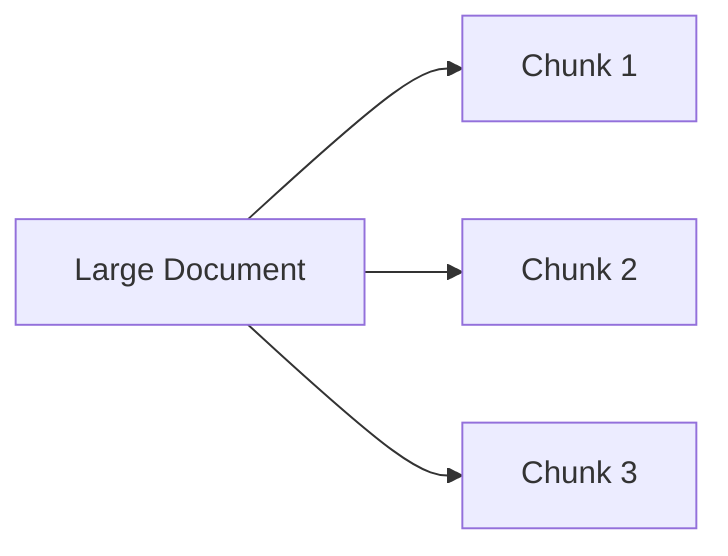
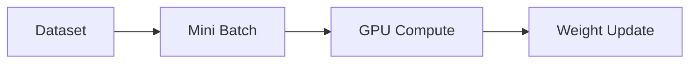
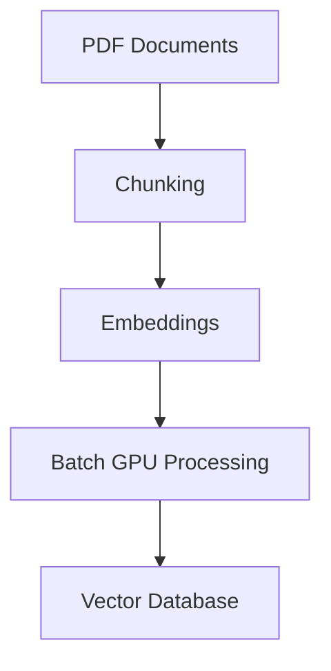

# Chunk vs Batch — AI Systems Foundations

A common beginner confusion in AI systems is the difference between:

- Chunk
- Batch

Even though both involve “splitting data into smaller parts”, they belong to completely different architectural layers.

---

# High-Level Mental Model

| Concept | Main Purpose         | Layer                         |
| ------- | -------------------- | ----------------------------- |
| Chunk   | Organize information | Data / Retrieval Architecture |
| Batch   | Optimize computation | GPU / Compute Architecture    |

---

# 1. What is a Chunk?

A chunk is a semantically meaningful piece of information.

Chunks are commonly used in:

- RAG systems
- Search engines
- NLP pipelines
- Document processing
- Vector databases

---

# Goal of Chunking

The purpose of chunking is:

```text
Split large information into smaller meaningful sections
```

---

# Example — Large Document

Imagine a:

```text
100-page PDF
```

A Large Language Model cannot process the entire document efficiently because of:

- context window limits
- retrieval inefficiency
- embedding quality issues

So the document is split into smaller parts.

---

# Chunking Pipeline



---

# Example Chunks

```text
Chunk A → Kubernetes Scheduler
Chunk B → Pods
Chunk C → Services
Chunk D → Networking
```

Each chunk contains a focused topic.

---

# Chunk Focus

Chunking focuses on:

```text
semantic meaning
```

---

# Chunk Optimization Goals

| Goal                | Why                            |
| ------------------- | ------------------------------ |
| Semantic retrieval  | Better search accuracy         |
| Context fitting     | Fit inside LLM context window  |
| Knowledge isolation | Easier retrieval               |
| Better embeddings   | Cleaner vector representations |

---

# Chunking in RAG Systems


---

# Important Insight

Chunking belongs to:

# INFORMATION ARCHITECTURE

It is about organizing knowledge.

---

# 2. What is a Batch?

A batch is a group of data samples processed together during computation.

Batches are commonly used in:

- model training
- inference serving
- GPU acceleration
- tensor computation

---

# Goal of Batching

The purpose of batching is:

```text
Process many data samples simultaneously
```

to maximize GPU efficiency.

---

# Example — AI Training

Dataset:

```text
1 million images
```

Training all images at once would exceed:

- VRAM limits
- compute limits

So the dataset is divided into smaller groups.

---

# Batch Example

```text
Batch 1 → 64 images
Batch 2 → 64 images
Batch 3 → 64 images
```

---

# Batch Processing Pipeline



---

# Batch Focus

Batching focuses on:

```text
compute efficiency
```

---

# Batch Optimization Goals

| Goal             | Why                       |
| ---------------- | ------------------------- |
| GPU utilization  | Parallel computation      |
| VRAM fitting     | Prevent memory overflow   |
| Throughput       | Faster processing         |
| Stable gradients | Better training stability |

---

# Core Differences

| Aspect        | Chunk                | Batch                |
| ------------- | -------------------- | -------------------- |
| Purpose       | Organize meaning     | Optimize computation |
| Main Concern  | Semantic structure   | Parallel execution   |
| Used In       | RAG / Search         | Training / Inference |
| Decided By    | Information quality  | GPU memory limits    |
| Contains      | Text/document pieces | Data samples/tensors |
| Optimized For | Retrieval accuracy   | Compute performance  |

---

# Simple Analogy

## Chunk

Chunking is like:

```text
splitting a textbook into chapters
```

so information is easier to:

- search
- retrieve
- reference

---

## Batch

Batching is like:

```text
feeding 64 exam papers into a scanner simultaneously
```

to maximize hardware efficiency.

---

# Real-World Example — RAG + GPU Pipeline



---

# Important Insight

A system may use BOTH:

- chunking
- batching

at different stages.

Example:

## Stage 1 — Chunking

```text
Split documents into semantic sections
```

## Stage 2 — Batching

```text
Process multiple chunks simultaneously on GPU
```

---

# System-Level Impact

## Chunking Quality Affects

- retrieval accuracy
- hallucination rate
- context relevance
- semantic search quality

---

## Batching Quality Affects

- GPU utilization
- latency
- throughput
- serving cost
- training speed

---

# Final Mental Model

## Chunk

```text
How to organize knowledge
```

---

## Batch

```text
How to efficiently compute data
```

[Back to the AI-Foundations-For-Software-Engineer](AI-Foundations-For-Software-Engineer.nd)
