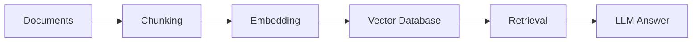
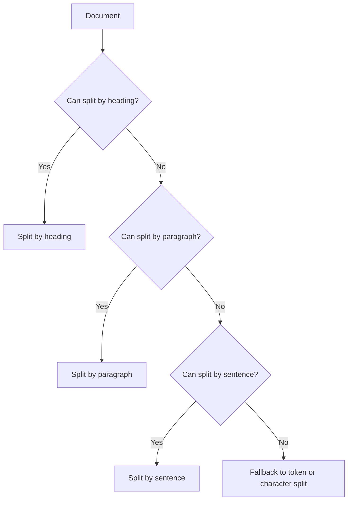
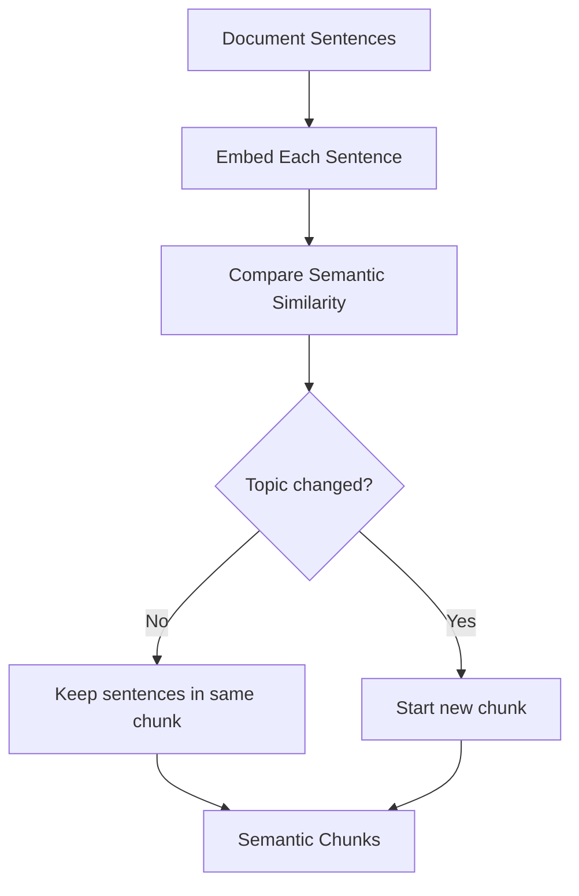
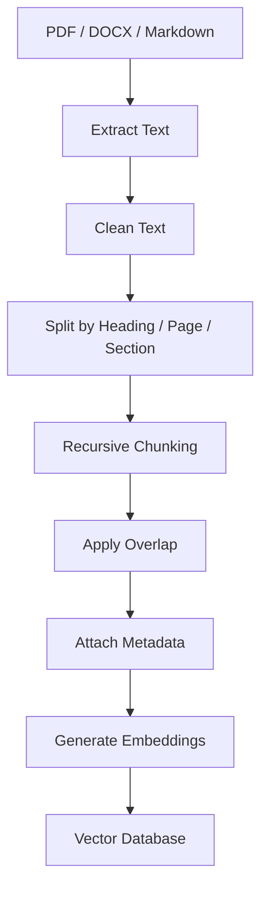
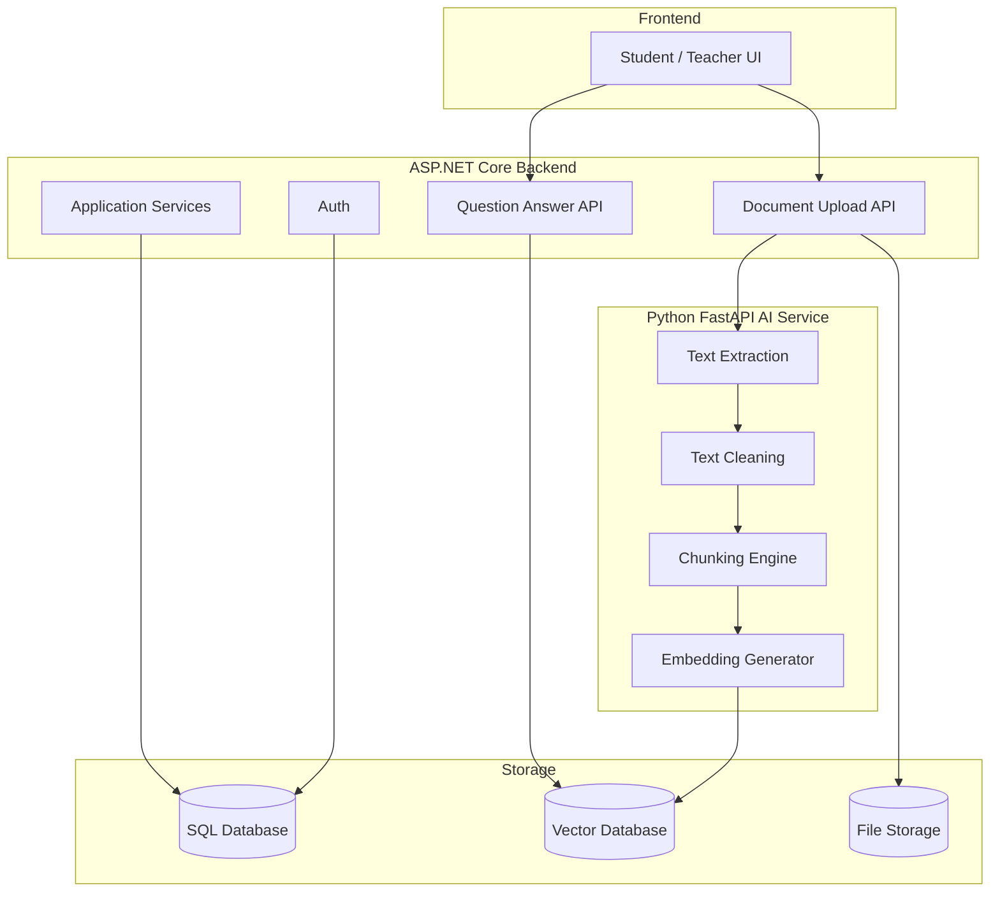
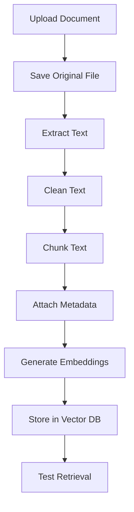

# RAG Chunking Strategies — Research Notes

**Date**: 2026-05-18  
**Project**: Intelligent Academic Assistant using RAG and ASP.NET Core  
**Issue**: Defines chunking strategies: fixed-size, sliding window, semantic chunking, recursive chunking, hybrid chunking  
**Label**: Research

---

## Table of Contents

1. [What Problem Does Chunking Solve?](#1-what-problem-does-chunking-solve)
2. [Chunk vs Batch](#2-chunk-vs-batch)
3. [RAG Pipeline Overview](#3-rag-pipeline-overview)
4. [Fixed-Size Chunking](#4-fixed-size-chunking)
5. [Sliding Window Chunking](#5-sliding-window-chunking)
6. [Recursive Chunking](#6-recursive-chunking)
7. [Semantic Chunking](#7-semantic-chunking)
8. [Hybrid Chunking](#8-hybrid-chunking)
9. [Comparison Table](#9-comparison-table)
10. [Recommended Strategy](#10-recommended-strategy)
11. [Architecture Recommendation](#11-architecture-recommendation)
12. [Implementation Flow](#12-implementation-flow)
13. [Final Mental Model](#13-final-mental-model)

---

## 1. What Problem Does Chunking Solve?

In a RAG system, documents are usually too large to send directly into an LLM.

Example:

```text
A 100-page PDF cannot be inserted into the LLM prompt efficiently.
```

So we split the document into smaller meaningful parts called **chunks**.

A good chunk should be:

- Small enough to fit into retrieval and prompt context
- Large enough to preserve meaning
- Focused on one idea or topic
- Easy to retrieve from a vector database
- Connected to metadata such as document name, page number, and section title

Bad chunking causes bad retrieval.

Bad retrieval causes weak context.

Weak context causes incorrect or hallucinated answers.

---

## 2. Chunk vs Batch

Chunk and batch both split data, but they solve different problems.

| Concept | Main Purpose         | Layer                         |
| ------- | -------------------- | ----------------------------- |
| Chunk   | Organize information | Data / Retrieval Architecture |
| Batch   | Optimize computation | GPU / Compute Architecture    |

### Chunk

```text
Chunk = how to organize knowledge
```

Used in:

- RAG systems
- Search engines
- Document processing
- Vector databases

### Batch

```text
Batch = how to process data efficiently
```

Used in:

- Model training
- GPU processing
- Inference serving

Simple analogy:

```text
Chunking = splitting a textbook into chapters
Batching = scanning many exam papers at the same time
```

---

## 3. RAG Pipeline Overview



### Explanation

1. Documents are uploaded.
2. Documents are split into chunks.
3. Each chunk is converted into an embedding vector.
4. Vectors are stored in a vector database.
5. The user question is also embedded.
6. The system retrieves the most similar chunks.
7. The LLM answers using retrieved chunks as context.

---

## 4. Fixed-Size Chunking

Fixed-size chunking splits text by a fixed length.

Example:

```text
Every 500 tokens = 1 chunk
```


### Advantages

| Advantage         | Explanation                  |
| ----------------- | ---------------------------- |
| Easy to implement | Simple logic                 |
| Fast              | No NLP model required        |
| Predictable       | Every chunk has similar size |
| Good baseline     | Useful for MVP experiments   |

### Disadvantages

| Disadvantage                     | Explanation                                       |
| -------------------------------- | ------------------------------------------------- |
| Can cut meaning                  | A definition may be split into two chunks         |
| Weak context preservation        | It ignores paragraphs and headings                |
| Lower retrieval quality          | Important context may be missing                  |
| Not ideal for academic documents | Lessons often depend on sections and explanations |

### Best Use Case

Use fixed-size chunking only as a simple baseline.

---

## 5. Sliding Window Chunking

Sliding window chunking is fixed-size chunking with overlap.

Example:

```text
chunk_size = 500 tokens
chunk_overlap = 100 tokens
```


### Why Overlap Helps

Important information often appears at the boundary between two chunks.

Overlap helps preserve context across chunk boundaries.

### Advantages

| Advantage                      | Explanation                              |
| ------------------------------ | ---------------------------------------- |
| Better context than fixed-size | Reduces boundary information loss        |
| Easy to implement              | Only adds overlap                        |
| Good for Q&A                   | Questions often need surrounding context |

### Disadvantages

| Disadvantage                 | Explanation                              |
| ---------------------------- | ---------------------------------------- |
| More storage                 | Overlapping text is duplicated           |
| More embedding cost          | More text must be embedded               |
| Possible duplicate retrieval | Similar chunks may appear in top results |

---

## 6. Recursive Chunking

Recursive chunking tries to split text using natural boundaries first.

Priority:

```text
Heading → Paragraph → Sentence → Word → Character
```



### Advantages

| Advantage                      | Explanation                              |
| ------------------------------ | ---------------------------------------- |
| Preserves structure            | Keeps paragraphs and sentences together  |
| Better than fixed-size         | Less likely to cut meaning randomly      |
| Good for MVP                   | Simple and practical                     |
| Good for educational documents | Academic documents usually have sections |

### Disadvantages

| Disadvantage            | Explanation                                          |
| ----------------------- | ---------------------------------------------------- |
| Not truly semantic      | It preserves structure, not meaning                  |
| Depends on text quality | Bad PDF extraction can produce bad chunks            |
| Needs cleaning          | Headers, footers, and broken lines should be removed |

### MVP Recommendation

For Stage 1, use:

```text
Recursive chunking + overlap + metadata
```

---

## 7. Semantic Chunking

Semantic chunking splits documents based on meaning.

Instead of asking:

```text
Has the chunk reached 500 tokens?
```

It asks:

```text
Has the topic changed?
```



### Advantages

| Advantage                   | Explanation                                 |
| --------------------------- | ------------------------------------------- |
| Strong meaning preservation | Chunks follow topic boundaries              |
| Higher retrieval quality    | Better match between question and chunk     |
| Good for academic documents | Definitions and explanations stay together  |
| Useful for Stage 2 research | Can be benchmarked against baseline methods |

### Disadvantages

| Disadvantage    | Explanation                           |
| --------------- | ------------------------------------- |
| Slower          | Requires embeddings during chunking   |
| More expensive  | More AI/NLP processing                |
| Harder to debug | Split points are less predictable     |
| Needs tuning    | Similarity threshold must be adjusted |

---

## 8. Hybrid Chunking

Hybrid chunking combines multiple strategies.

Recommended hybrid flow:

```text
1. Split by document structure
2. Apply recursive chunking inside each section
3. Add overlap
4. Optionally use semantic chunking for long sections
5. Attach metadata
```



### Advantages

| Advantage                    | Explanation                                |
| ---------------------------- | ------------------------------------------ |
| Best real-world quality      | Combines structure and meaning             |
| Great for academic documents | Preserves chapters, sections, and examples |
| Better citation support      | Metadata can store page and section        |
| Scalable                     | Can start simple and improve later         |

### Disadvantages

| Disadvantage        | Explanation                                 |
| ------------------- | ------------------------------------------- |
| More complex        | More engineering work                       |
| Needs testing       | Different document types behave differently |
| More pipeline steps | Requires clean architecture                 |

---

## 9. Comparison Table

| Strategy       | Retrieval Accuracy | Context Preservation | Token Efficiency | Processing Speed | Scalability | Educational Docs |
| -------------- | ------------------ | -------------------- | ---------------- | ---------------- | ----------- | ---------------- |
| Fixed-size     | Low-Medium         | Low                  | High             | Very High        | Very High   | Low              |
| Sliding Window | Medium             | Medium               | Medium-Low       | High             | High        | Medium           |
| Recursive      | Medium-High        | High                 | Medium-High      | High             | High        | High             |
| Semantic       | High               | Very High            | Medium           | Medium-Low       | Medium      | High             |
| Hybrid         | Very High          | Very High            | Medium           | Medium           | Medium-High | Very High        |

---

## 10. Recommended Strategy

### Stage 1 — MVP

Use:

```text
Recursive chunking + sliding overlap + metadata
```

Recommended config:

```text
chunk_size: 500-800 tokens
chunk_overlap: 80-150 tokens

metadata:
  - document_id
  - file_name
  - page_number
  - section_heading
  - chunk_index
```

Why:

- Easy to implement
- Good enough retrieval quality
- Easy to debug
- Suitable for academic documents
- Good balance between quality and complexity

### Stage 2 — Optimization

Use:

```text
Hybrid chunking + semantic chunking benchmark
```

Benchmark multiple strategies:

| Config | Strategy  | Chunk Size | Overlap | Goal                    |
| ------ | --------- | ---------: | ------: | ----------------------- |
| A      | Recursive |        512 |      50 | Baseline                |
| B      | Recursive |        800 |     120 | More context            |
| C      | Semantic  |   Variable |    Auto | Meaning-based split     |
| D      | Hybrid    |   Variable |     100 | Best academic candidate |

Evaluation metrics:

- Hit@K
- MRR
- nDCG
- Retrieval latency
- Index size
- Answer faithfulness

---

## 11. Architecture Recommendation

ASP.NET Core should be the main backend.

Python FastAPI should handle AI document processing.



### Responsibility Split

| Component       | Responsibility                                  |
| --------------- | ----------------------------------------------- |
| ASP.NET Core    | Auth, APIs, business logic, document management |
| Python FastAPI  | Parsing, chunking, embedding, RAG experiments   |
| Vector Database | Semantic search                                 |
| SQL Database    | Users, documents, permissions, history          |
| File Storage    | Original uploaded files                         |

---

## 12. Implementation Flow



### MVP Steps

1. Upload document through ASP.NET Core.
2. Save original file.
3. Send file path or file stream to Python FastAPI.
4. Extract text.
5. Clean text.
6. Apply recursive chunking with overlap.
7. Attach metadata.
8. Generate embeddings.
9. Store chunks and vectors.
10. Test retrieval with sample questions.

---

## 13. Final Mental Model

```text
Chunking is not just cutting text.
Chunking is designing knowledge units for retrieval.
```

A good RAG system depends on good chunks.

```text
Good chunking → Better retrieval
Better retrieval → Better context
Better context → Better LLM answer
```

Final architecture idea:

```text
ASP.NET Core handles the application.
Python handles the AI document pipeline.
Vector DB handles semantic search.
LLM handles answer generation.
```

Final recommendation:

```text
Stage 1:
Use recursive chunking with overlap and metadata.

Stage 2:
Benchmark hybrid and semantic chunking.

Architecture:
Use Python FastAPI as a separate chunking and embedding service,
while ASP.NET Core remains the main backend.
```
